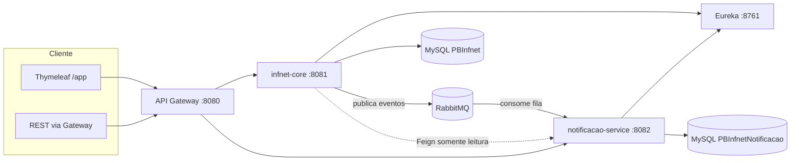
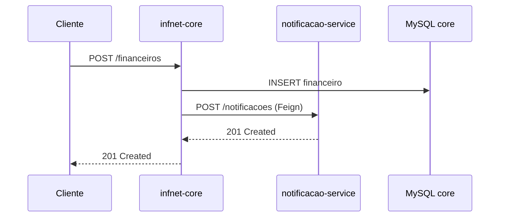
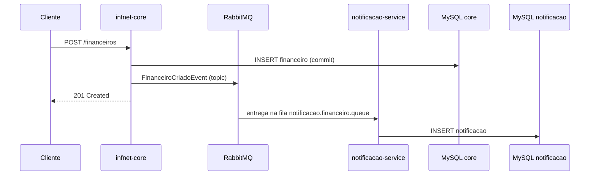

# Quarta Entrega — Arquitetura Orientada a Eventos (RabbitMQ)

## 1. Motivação da refatoração

Na **3ª entrega**, ao salvar um lançamento financeiro, o monolito (`infnet-core`) chamava o microsserviço de notificações de forma **síncrona** via **OpenFeign**. Isso acopla disponibilidade, latência e transação local ao serviço remoto.

Na **4ª entrega**, o fluxo de **escrita** foi desacoplado: o monolito **persiste** o dado e **publica um evento** no RabbitMQ. O `notificacao-service` **consome** o evento e cria a notificação de forma **assíncrona**.

O **Feign** permanece apenas para **leituras** no painel Thymeleaf (listar notificações), onde a resposta imediata ao usuário ainda faz sentido.

---

## 2. Prós e contras da arquitetura orientada a eventos

| Prós | Contras |
|------|---------|
| **Desacoplamento** entre produtor e consumidor | **Consistência eventual** — notificação pode aparecer segundos depois do save |
| **Escalabilidade** — vários consumidores na mesma fila | **Complexidade operacional** (broker, filas, DLQ, monitoramento) |
| **Resiliência** — fila absorve picos; retry e DLQ | **Depuração** mais difícil (fluxo distribuído) |
| **Transações locais mais curtas** — commit no DB antes do publish | **Duplicidade** possível → consumidores devem ser **idempotentes** quando crítico |
| **Extensibilidade** — novos ouvintes sem alterar o monolito | **Contratos de evento** precisam de versionamento/disciplina |

**Cenários onde EDA é mais vantajosa:** integrações assíncronas (e-mail, push, auditoria), picos de carga, vários bounded contexts reagindo ao mesmo fato, e quando falha temporária do consumidor não pode derrubar o fluxo principal.

**Cenários onde REST síncrono ainda é melhor:** consultas que exigem resposta imediata na mesma tela, validações que bloqueiam a operação, ou operações que precisam de **consistência forte** entre dois serviços na mesma requisição.

---

## 3. Padrões de mensagens utilizados

| Padrão | Onde | Descrição |
|--------|------|-----------|
| **Topic Exchange (pub/sub)** | `infnet.events.topic` | Routing keys com wildcard (`financeiro.criado.#`) permitem filtrar receita/despesa e adicionar novos assinantes. |
| **Event-Carried State Transfer** | `FinanceiroCriadoEvent`, `UsuarioCriadoEvent` | O payload leva dados suficientes para o consumidor agir sem nova chamada HTTP ao monolito. |
| **Work queue dedicada** | `notificacao.financeiro.queue` | Uma fila por consumidor de negócio (notificações), processamento competindo entre instâncias do mesmo serviço. |
| **Dead Letter Exchange (DLX)** | `infnet.events.dlx` + `notificacao.financeiro.dlq` | Mensagens que falham após retries vão para DLQ para análise manual. |
| **Fire-and-forget (outbox simplificado)** | `FinanceiroService` | Após `save`, publica evento; falha no broker é logada (não reverte o commit JPA). |

Constantes e topologia compartilhadas: módulo **`infnet-events`**.

---

## 4. Diagrama de arquitetura (visão lógica)

---

## 5. Fluxo de eventos — antes vs depois

### Antes (3ª entrega — acoplado)

### Depois (4ª entrega — eventos)

---

## 6. Topologia RabbitMQ

| Recurso | Nome |
|---------|------|
| Exchange principal | `infnet.events.topic` (topic) |
| Exchange DLX | `infnet.events.dlx` |
| Fila notificações | `notificacao.financeiro.queue` → binding `financeiro.criado.#` |
| Fila auditoria (demo) | `auditoria.usuario.queue` → binding `usuario.criado` |
| DLQ | `notificacao.financeiro.dlq` |

**Routing keys:**

- `financeiro.criado.receita` — receitas
- `financeiro.criado.despesa` — despesas
- `usuario.criado` — novo usuário (listener de auditoria no core)

---

## 7. Componentes no código

| Módulo | Responsabilidade |
|--------|------------------|
| `infnet-events` | DTOs de evento, constantes, `RabbitMQTopologyConfig` |
| `infnet-core` | `EventPublisher`, `FinanceiroService` / `UsuarioService` (produtores), `UsuarioEventAuditListener` |
| `notificacao-service` | `FinanceiroEventConsumer`, `NotificacaoFromFinanceiroProcessor` |

Spring Boot: `spring-boot-starter-amqp`, `@RabbitListener`, `RabbitTemplate` + `Jackson2JsonMessageConverter` (Java Time).

---

## 8. Como executar com RabbitMQ

1. Subir o broker: na raiz do projeto, `docker compose up -d`
2. Management UI: http://localhost:15672 (guest/guest)
3. MySQL e serviços Java conforme `README.md` na raiz

**Teste manual:** criar um financeiro via API; em alguns segundos, consultar `GET /notificacoes/usuario/{id}` ou o painel `/app`.
