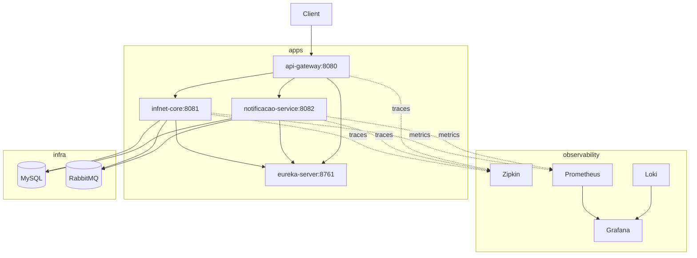

# 5ª Entrega — Implantação e Manutenção em Produção

## Objetivo

Preparar o sistema Infnet para **operação em produção** com conteinerização (Docker), orquestração (Kubernetes), **monitoramento** (métricas, logs, tracing) e **CI/CD** (GitHub Actions).

---

## 1. Conteinerização (Docker)

### Dockerfile multi-stage

Arquivo: `docker/Dockerfile`  
Build parametrizado por microsserviço:

```bash
docker build -f docker/Dockerfile --build-arg MAVEN_MODULE=infnet-core -t infnet/infnet-core:latest .
```

Módulos: `eureka-server`, `infnet-core`, `notificacao-service`, `api-gateway`.

### Profile `docker`

Cada serviço possui `application-docker.properties` com hosts de rede Docker/Kubernetes (`mysql`, `rabbitmq`, `eureka-server`, `zipkin`) e inclui o profile **`observability`**.

### Stack completa (Compose)

```bash
docker compose -f docker/compose/docker-compose.prod.yml up -d --build
```

| Serviço | URL local |
|---------|-----------|
| API Gateway / app | http://localhost:8080/app |
| Eureka | http://localhost:8761 |
| RabbitMQ UI | http://localhost:15672 |
| Zipkin (tracing) | http://localhost:9411 |
| Prometheus | http://localhost:9090 |
| Grafana | http://localhost:3000 (admin/admin) |

Infra leve (só RabbitMQ, dev local): `docker compose up -d` na raiz do repositório.

---

## 2. Kubernetes

Manifests em `k8s/`:

| Arquivo | Conteúdo |
|---------|----------|
| `00-namespace.yaml` | Namespace `infnet` |
| `01-configmap.yaml` | Variáveis compartilhadas |
| `02-secret.yaml` | Senha MySQL (exemplo acadêmico) |
| `10-infra.yaml` | MySQL, RabbitMQ, Zipkin |
| `20-apps.yaml` | Eureka, core, notificação, gateway (réplicas 2) |
| `30-hpa.yaml` | Autoscaling CPU 70% (core e notificação) |
| `40-monitoring.yaml` | Prometheus + Grafana |

### Implantar (Minikube / cluster local)

```bash
# Build das imagens
for m in eureka-server infnet-core notificacao-service api-gateway; do
  docker build -f docker/Dockerfile --build-arg MAVEN_MODULE=$m -t infnet/$m:latest .
done

# Minikube: carregar imagens
minikube image load infnet/infnet-core:latest
# ... repetir para cada imagem

kubectl apply -f k8s/
kubectl get pods -n infnet
```

Gateway exposto via `Service` tipo `LoadBalancer` (ou `minikube service api-gateway -n infnet`).

---

## 3. Monitoramento

### Métricas (Prometheus + Actuator)

- Dependências: `spring-boot-starter-actuator`, `micrometer-registry-prometheus`
- Endpoint: `/actuator/prometheus`
- Scrape configurado em `docker/monitoring/prometheus/prometheus.yml` e `k8s/40-monitoring.yaml`

### Rastreamento distribuído (Zipkin + Sleuth)

- `spring-cloud-starter-sleuth` + `spring-cloud-sleuth-zipkin`
- Logs incluem `traceId` e `spanId` para correlacionar requisições entre microsserviços
- UI Zipkin: http://localhost:9411

### Agregação de logs (Loki + Grafana)

- **Loki** + **Promtail** no Docker Compose (coleta logs de contêineres)
- Grafana provisionado com datasources Prometheus e Loki (`docker/monitoring/grafana/provisioning`)

> No Windows, se o Promtail falhar por permissões de socket Docker, comente o serviço `promtail` no Compose; métricas e Zipkin continuam funcionando.

---

## 4. CI/CD — GitHub Actions

Workflow: `.github/workflows/ci-cd.yml`

| Job | Função |
|-----|--------|
| **test** | `./mvnw test` (unitários em todos os módulos) |
| **docker-build** | Build das 4 imagens Docker |
| **smoke-docker** | Sobe Compose, smoke test `system-tests`, derruba stack |
| **kubernetes-manifests** | `kubectl apply --dry-run=client -f k8s/` |

Branches: `main`, `TP4`, `TP5`.

---

## 5. Testes abrangentes

| Camada | Onde |
|--------|------|
| Unitários / integração JPA, eventos | `infnet-core`, `notificacao-service` |
| Contexto Gateway | `api-gateway` |
| **Smoke ponta a ponta** | `system-tests` — `PlatformSmokeIT` |

Smoke local (stack rodando):

```bash
docker compose -f docker/compose/docker-compose.prod.yml up -d --build
./mvnw -pl system-tests verify -Dgroups=integration
```

Variável opcional: `SMOKE_BASE_URL=http://localhost:8080`

---

## 6. Diagrama de implantação (Docker)



---

## 7. Manutenção e boas práticas

- **Configuração:** ConfigMaps/Secrets no K8s; profiles Spring para ambientes
- **Health checks:** `/actuator/health` em Dockerfile e probes K8s
- **Escalabilidade:** HPA no core e notificação; filas RabbitMQ absorvem picos assíncronos
- **Segurança:** credenciais de exemplo — trocar em produção real (Secrets Manager, etc.)
